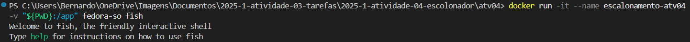
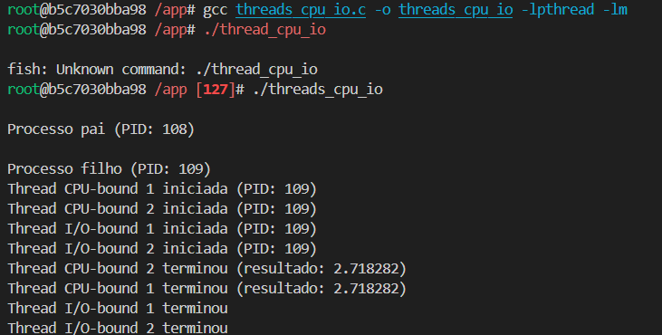
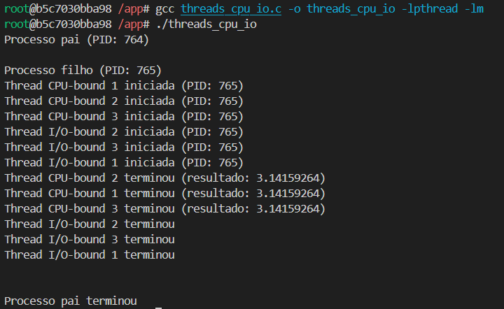
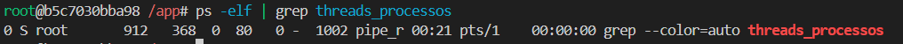

# S.O. 2025.1 - Atividade 04

Discente: Bernardo de Moura Medeiros
Data: 08/06/2025

---

## 1. Objetivo

Execução de código C dentro do container Docker criando um ambiente isolado de desenvolvimento capaz de compilar e executar programas nas linguagens C e efetuar o monitoramento. Por meio dessa atividade, foi possível observar na prática a diferença entre threads CPU-bound (que realizam cálculos intensivos, como o cálculo de π via série de Leibniz) e I/O-bound (que simulam operações de entrada/saída com sleep), analisando seu comportamento em um sistema concorrente.

## 2. Preparando ambiente

### Criando Imagem através do Dockerfile

Executei um Dockerfile criado com base nas informações da proposta da atividade. Contendo configurações necessárias para gerar uma imagem baseada na distro Fedora, incluindo o compilador para códigos C. Assim, baixei a imagem base do Fedora e fiz a instalação de todos os pacotes solicitados no Dockerfile.

### Execução do Container



A partir da execução da imagem, o terminal fish foi inicializado, indicando que o ambiente isolado foi criado com sucesso.

## 3. Compilação e execução de códigos

Uma vez que entrei no shell fish, compilei e executei o código C conforme citados no readme.

<div>
    
</div>

Conforme solicitado, modifiquei o código original, afim de - alterar o cálculo na thread CPU-bound para o cálculo de π utilizando a série de Leibniz.

<div>
    
</div>

## 4. Monitoramento

### Tempos de execução

Conferi o tempo de execução do programa threads_cpu_io utilizando o comando **time**

```bash
time ./threads_cpu_io
```

### Estatísticas 
Após conferir o tempo de execução efetuei a instalação do pacote perf, afim de adquirir as estatísticas sobre a performance do código e uso da CPU do cache, etc.
<div>
    
</div>

### Listagem de processos e threads
Comando elf afim de mostrar processos e threads do container.
<div>
    
</div>


## 5. Conclusão
A prática foi extremamente útil para observar que as threads I/O-bound terminam primeiro, pois ficam em estado de espera, liberando a CPU, enquanto as CPU-bound consomem mais tempo de processamento, porém produzem resultados precisos. O experimento comprovou a eficiência do escalonador do sistema operacional em gerenciar ambos os tipos de threads.